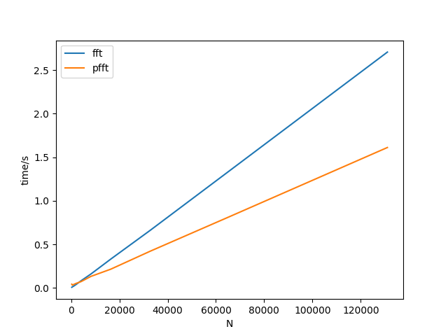

# RTS_Lab2.x
Real-time Systems laboratory works 2.1/2.2

## Додаткове завдання
Для реалізації паралельного виконання ШПФ було використано ProccessPoolExecutor зі стандартної бібліотеки concurrent.futures.

### Результат:

